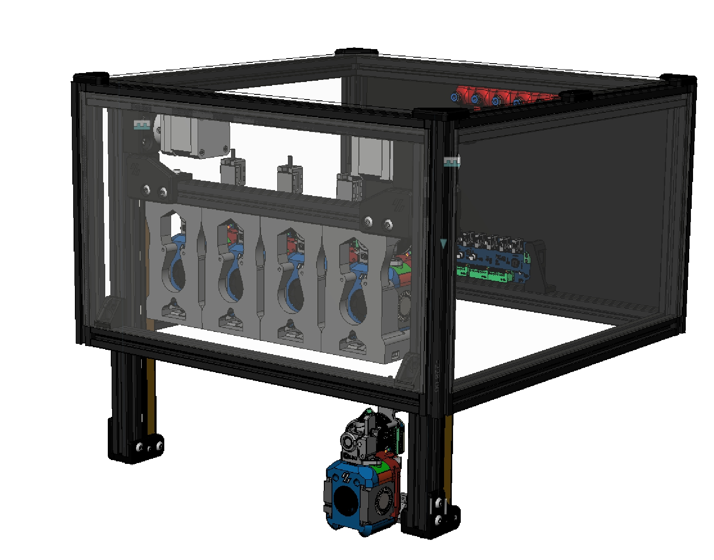
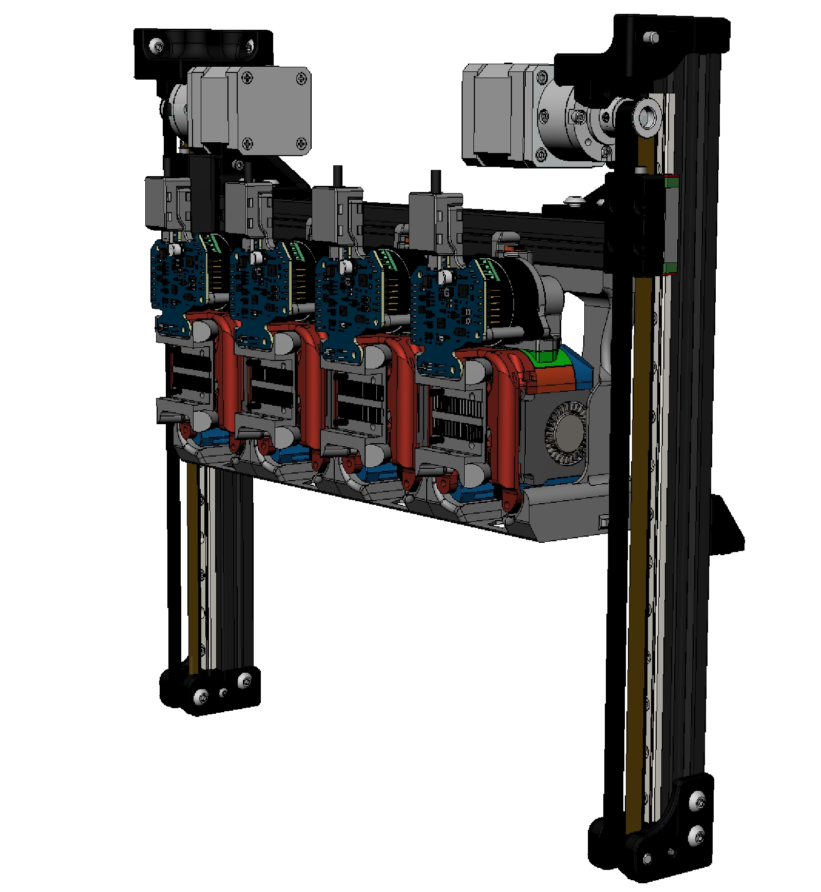
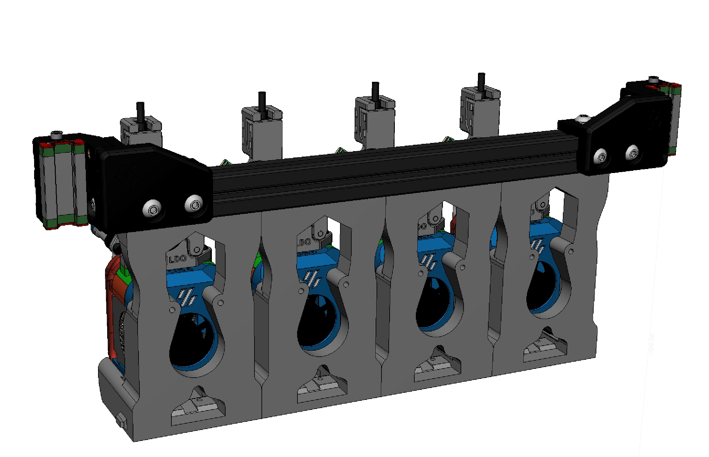
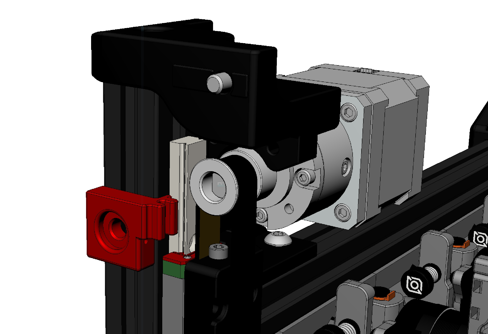
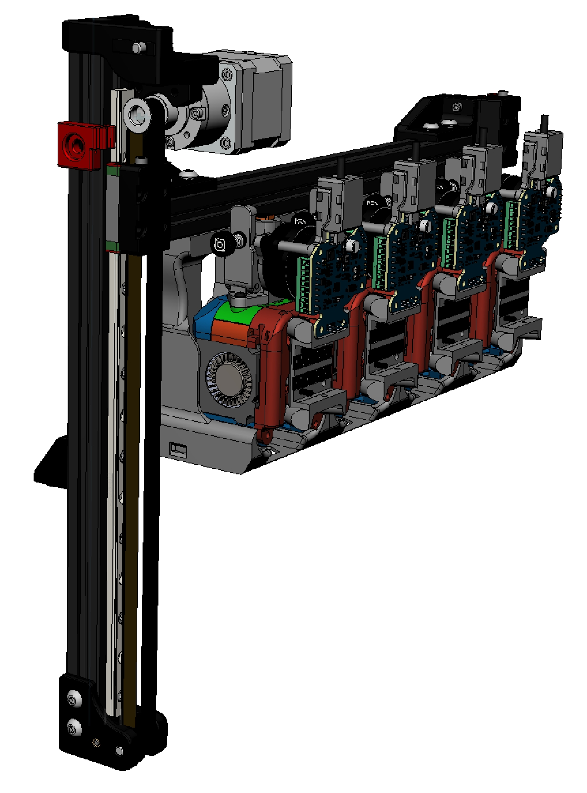

# Trident Liftbar Hat

## About the Hat

Installing a liftbar on the Trident requires modifying the height of the frame, so the idea was to add a hat to give the liftbar more room to move.

## Features

- An add on for trident
- east modifications with original tridnet
- Almost no printing space is occupied

## 1. BOM
2020 Extrusion:
 -  4x 240mm long for all build
 -  2x 330mm long for all build
    - 8x 370mm long for 250 build
    - 8x 420mm long for 300 build
    - 8x 470mm long for 350 build
    - 1x 290mm long for 250 build
    - 1x 340mm long for 300 build
    - 1x 390mm long for 300 build
 -  8x 2020 Straight Line Connector

Commens:
- 2x Omron d2f endstop switch
- 2x MGN9H + 300mm rail
- 2x 20T GT2 5mm Bore 10mm With idler 
- 2x 20T GT2 pulley
- 2x Nema17 Stepper Motor with Gearbox Integrated Reducer Speed Ratio 5.18
- 10mm GT2 belt 
- m3 bolts, heatset inserts, nuts
- m5 bolts, T-nuts

## Images

